<!-- ANIMATED ARC REACTOR & HUD HEADER -->

 

<!-- DYNAMIC TYPING TERMINAL -->

 

<!-- HUD STATUS TELEMETRY BADGES -->

  
  
  
  

---

### 🌐 `SYSTEM DIRECTIVE & BIOGRAPHY`

> ### ⚡ *"UI/UX Designer, FrontEnd Developer, Graphic Designer"*
> **I build modern websites, dashboards, and digital experiences with a strong focus on usability and clean design.**

---

### 📊 `HUD TELEMETRY // METRICS & STATS`

  <table border="0" cellspacing="0" cellpadding="0">
    <tr>
      <td align="center" valign="middle">
        <!-- GITHUB STATS IN CYAN HUD THEME -->
        
      </td>
      <td align="center" valign="middle">
        <!-- STREAK STATS IN CYAN HUD THEME -->
        
      </td>
    </tr>
  </table>

   

  <!-- TOP LANGUAGES TELEMETRY -->
  

---

### 🛠️ `SUBSYSTEM CAPABILITIES & TOOLS`

| Module | Technologies & Arsenal | Status |
| :--- | :--- | :---: |
| **🎨 UI/UX Architecture** | `Figma` • `Design Systems` • `Usability Analysis` • `Wireframing` | **`ACTIVE`** |
| **⚡ Frontend Engineering** | `JavaScript` • `TypeScript` • `HTML5 / CSS3` • `Responsive Layouts` | **`ACTIVE`** |
| **🤖 Modern Digital Systems** | `AI Agents` • `Automations` • `Next-Gen Dashboards` | **`ACTIVE`** |

---

### 📡 `COMMUNICATION CHANNELS`

  
  &nbsp;&nbsp;
  

 

  PROTOCOL: J.A.R.V.I.S. // STARK INDUSTRIES // ALL SYSTEMS NOMINAL

